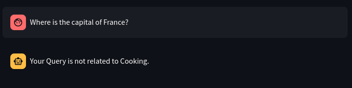
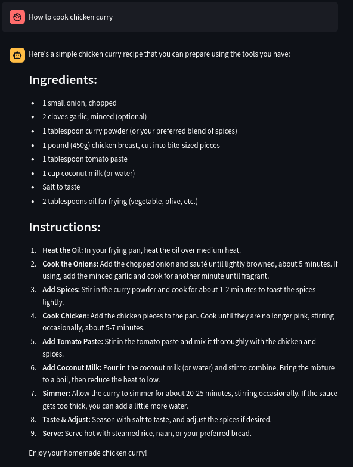
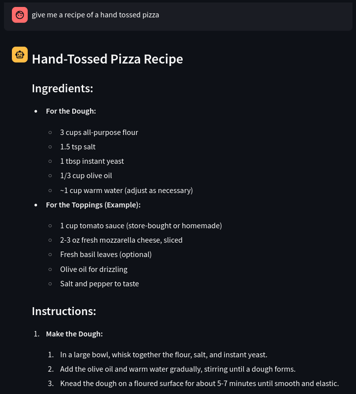
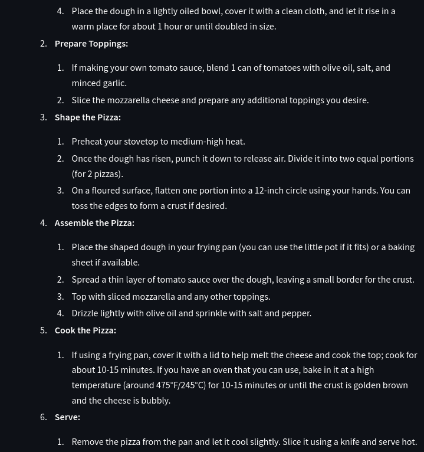
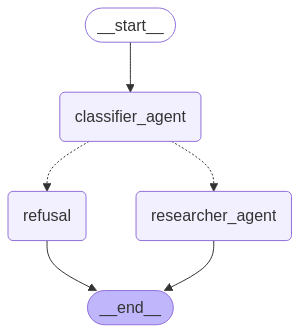
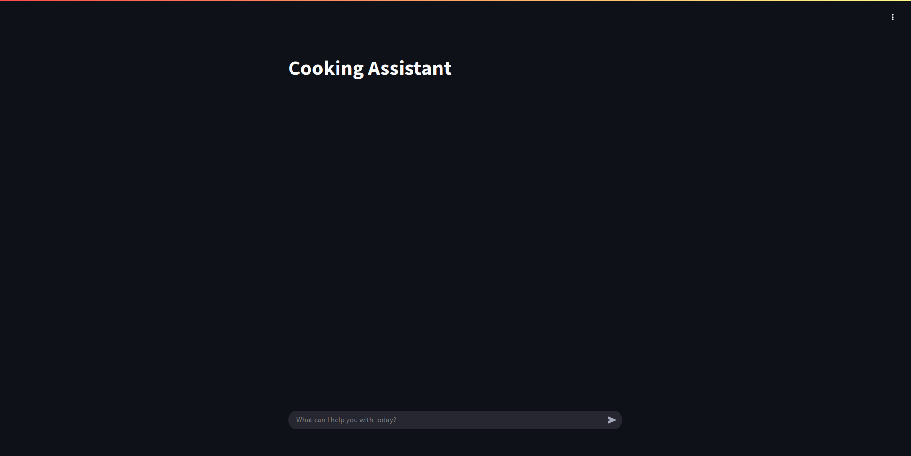

# Cooking Assistant Agent Using LangGraph  

## Overview

The Cooking Assistant is an AI-powered application designed to provide customized recipes and cooking advice. It leverages LangGraph for orchestrating agent workflows, ensuring reliability, control, and efficiency in handling user queries. Using FastAPI for the backend, the system classifies queries into relevant or irrelevant categories. Relevant cooking queries are processed using a ReAct-powered researcher agent for web-assisted responses. The user interface is built with Streamlit for seamless interaction, while Docker ensures consistent deployment across environments. The project is scalable for cloud deployment on platforms like AWS, offering an intelligent and user-friendly cooking assistant experience.

## Use Cases
1. User ask the general Question. But user gets the refusal as the user query is not related to Cooking Assistant.

<p align="center">
  
</p>

2. User asked `How to cook chicken curry`. and gets the recipe that will work on the available tools to the user.

<p align="center">
  
</p>

3. User asked for a recipe that needs oven, but get's the recipe that will cook the same thing using fry pan as oven is not in our available tools.

<p align="center">
  
  
  
</p>

---

## Prerequisites  

- Python 3.12 or above  
- `pip` (Python package manager)  
- Tavily API Key, Langsmith API Key and OpenAI API Key  

## Technology Stack  

- **Python**: Core programming language.  
- **FastAPI**: Lightweight web framework for building RESTful APIs.  
- **LangChain**: Framework for building AI-powered applications.  
- **LangGraph**: A custom state graph implementation for workflow.  
- **Tavily API**: Integrated for recipe search results. 
- **Docker**: Docker is a containerisation platform – it is a toolkit that allows you to build, deploy and manage containerised applications 
- **Streamlit**: Light weight UI framework for AI applications.
- **AWS**: Cloud for the deployment.

### LangGraph

LangGraph — is a low-level orchestration framework for building controllable agents. While langchain provides integrations and composable components to streamline LLM application development, the LangGraph library enables agent orchestration — offering customizable architectures, long-term memory, and human-in-the-loop to reliably handle complex tasks. To learn more about langgraph, visit langgraph official [git repo](https://github.com/langchain-ai/langgraph).

#### Why use LangGraph?

LangGraph is built for developers who want to build powerful, adaptable AI agents. Developers choose LangGraph for:

- Reliability and controllability. Steer agent actions with moderation checks and human-in-the-loop approvals. LangGraph persists context for long-running workflows, keeping your agents on course.
- Low-level and extensible. Build custom agents with fully descriptive, low-level primitives – free from rigid abstractions that limit customization. Design scalable multi-agent systems, with each agent serving a specific role tailored to your use case.
- First-class streaming support. With token-by-token streaming and streaming of intermediate steps, LangGraph gives users clear visibility into agent reasoning and actions as they unfold in real time.

#### LangGraph in Cooking Assistant

Langgraph is used to orchecterate the agent and to implement the workflow of the agent with more control, there are many other frameworks for the agent to build on, but they run agents automonously and have limited control. But langgraph pplay more role in providing hte more control in agents workflow.

<p align="center">
  
</p>

The Cooking Assistant begins with the classifier_agent, which assesses the user's query for cooking relevance.  Irrelevant queries are immediately routed to the refusal node, providing a rejection message.  Relevant queries proceed to the researcher_agent, a powerful ReAct agent. This agent utilizes web search to gather information, enabling it to think, observe, and act in response to the user's cooking-related needs.  Both paths ultimately converge at the end node, concluding the interaction.

### Streamlit

Streamlit is an open-source app framework that allows you to create interactive and data-driven web applications in Python quickly. In this project, Streamlit was used to build a user-friendly interface that allows for easy interaction with the Cooking Assistant Agent.

<p align="center">
  
</p>

"The Cooking Assistant uses LangGraph to orchestrate a workflow, beginning with the `classifier_agent` to determine query relevance. Irrelevant queries are routed to `refusal`; relevant ones to the ReAct-powered `researcher_agent` for web-assisted responses. Both paths end at `end`."

### Docker

Docker is a software platform that allows you to build, test, and deploy applications quickly. Docker packages software into standardized units called containers that have everything the software needs to run including libraries, system tools, code, and runtime. To learn more about docker, visit there official [doc](https://docs.docker.com/).

To create the docker image, run the command,
```bash
   sudo docker build -t <image_name> .
   ```

To run the container, run the command,
```bash
   sudo docker run -it -p 8000:8000 <image_name>
   ```

### FastAPI
FastAPI is a modern, fast (high-performance), web framework for building APIs with Python based on standard Python type hints.

#### Test endpoint

##### Relevant Query:
```bash
curl -X POST "http://localhost:8000/query" -H "Content-Type: application/json" -d '{"user_input": "How do I bake a chocolate cake?"}'
```

##### Response:
```json
{
  "response": "To bake a chocolate cake, you will need..."
}
```

##### Irrelevant Query:
```bash
curl -X POST "http://localhost:8000/query" -H "Content-Type: application/json" -d '{"user_input": "What is the capital of France?"}'
```

##### Response:
```json
{
  "response": "Your Query is not related to Cooking."
}
```

### AWS Deployment
To see the aws deployment documentation, visit [here]().

---
